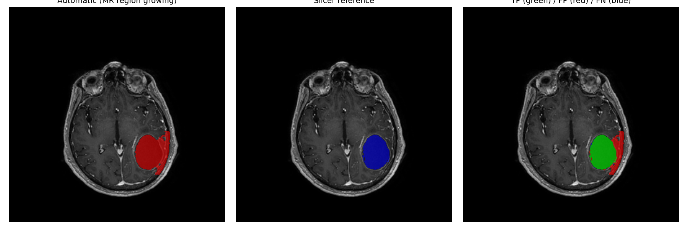

# Project 11763 – Dynamic PET + MR Brain Study

End-to-end pipeline for a brain dynamic-PET study coregistered to a T1+C MR,
followed by a semi-automatic tumour segmentation.

## Scripts

| File | What it does |
|------|--------------|
| `part1_dicom.py`            | Load PET and MR DICOMs, inspect headers, reshape the PET into `(frames, slices, rows, cols)`, save GIFs of the three median planes, cache the volumes as `.npy`. |
| `part2_coregistration.py`   | Rigid 3-D coregistration (Mattes Mutual Information + Euler transform) of the average PET to the MR via PyElastix.  Computes NMI / NCC, saves the forward and inverse deformation fields, and exports the rotating-MIP GIFs (MR, registered PET, fusion). |
| `part3_segmentation.py`     | Interactive prompt selection (slice + bounding box) and semi-automatic tumour segmentation through the MONAI Label client.  Falls back to a 3-D region-growing baseline if the server is unreachable. |
| `part3_evaluate_slicer.py`  | Loads a 3-D Slicer manual mask as gold standard, runs an MR-intensity region-growing automatic baseline, and reports Dice / IoU / Sensitivity / Hausdorff on `outputs/`. |

Run them in order:

```bash
python part1_dicom.py
python part2_coregistration.py
python part3_segmentation.py        # optional, needs MONAI Label
python part3_evaluate_slicer.py
```

## Folder layout

```
project/
├── data/                       # raw DICOM files (PET + MR)
├── outputs/                    # generated GIFs, figures, masks, metrics
├── studies/brain/              # MONAI Label studies folder (Part 3 only)
├── part1_dicom.py
├── part2_coregistration.py
├── part3_segmentation.py
├── part3_evaluate_slicer.py
└── report.tex
```

## Python environment

```bash
python -m venv .venv
source .venv/bin/activate          # Windows: .venv\Scripts\activate
pip install -U pip
pip install pydicom numpy scipy matplotlib opencv-python imageio pyelastix nibabel
```

Part 2 also needs **Elastix** (the C++ binary).  Either install it at
`../elastix/` next to the project or set the `ELASTIX_PATH` environment
variable to point at your installation.

## MONAI Label (Part 3 only)

```bash
pip install monailabel
monailabel apps --download --name radiology --output apps
monailabel start_server --app apps/radiology --studies studies/brain --conf models deepedit
```

If you have a GPU you can switch to VISTA-3D through the `monaibundle`
app:

```bash
monailabel apps --download --name monaibundle --output apps
monailabel start_server --app apps/monaibundle --studies studies/brain --conf models vista3d
set MONAI_LABEL_MODEL=vista3d        # Linux: export MONAI_LABEL_MODEL=vista3d
```

On our study neither DeepEdit (multi-organ CT only) nor VISTA-3D
produced a usable brain-tumour mask out of the box, so the gold
standard was drawn by hand in **3-D Slicer** and the automatic
baseline is the MR region-growing algorithm in
`part3_evaluate_slicer.py`.  See `report.tex` for the full discussion.

## Outputs

After running the four scripts, `outputs/` contains:

* `axial.gif`, `coronal.gif`, `sagittal.gif` – temporal PET planes
* `mr_mip.gif`, `pet_mip.gif`, `fusion_mip.gif` – rotating MIPs
* `part2_qc.png`, `part2_metrics.txt`
* `part3_pet_all_slices.png` – slice grid for prompt selection
* `part3_slicer_overlay.png`, `part3_auto_overlay.png`,
  `part3_auto_vs_slicer.png`, `part3_metrics_slicer.txt`

